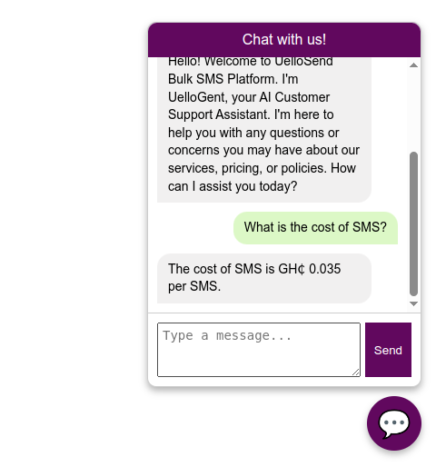

# Customer Support Automation With UelloSend AI Agents

The project provided me an opportunity to put everything I learned as an AI Intern at Dataphyte UK to use. 

This is a full production grade application, and we are making the full code  available for other learners. 

The source code is well documented to make it easy to understand what each code block is doing.

Any learner who carefully explores the code will have basic understanding and implementation of concepts like 
 - Retrieval-Augmented Generation
 - Building AI Agents with no framework
 - Using LLM APIs (OpenAI and Google GenerativeAI SDK)
 - Building REST server with FastAPI
 - Implement Rate Limiting with SlowAPI
 - Logging with Pydantic Logfire
 - Error handling
 - Using docker
 - Working with SQLite3
 - Session management
 - Crafting effective system prompts
 - Scraping web pages using Langchain

Learners must use resources available on the internet to better understand the concepts used in this project.

### Highlevel Overview 

The system is made of two agents:

**UelloSendAgent**

- Functionality: This agent  is designed for task execution and process automation. It utilizes Gemini Large Language Model (LLM) augmented with a defined set of tools and capabilities, accessed via robust API integrations or function calling mechanisms.
  
- Core Responsibilities: It directly interacts with the UelloSend platform's backend systems (via dedicated APIs) to fulfill specific, action-oriented customer requests. Key examples include:
  - Initiating and managing password reset workflows.
  - Executing account verification procedures.
  - Diagnosing and resolving discrepancies or failures in credit top-up transactions.

- This agent was developed using Google Generative AI SDK

**QueryAgent**

- Functionality: This agent specializes in providing informative responses to user enquiries. It is powered by Llama 4 Large Language Model (LLM) integrated within a Retrieval-Augmented Generation (RAG) pipeline, which is composed of embedding, searching, and generation.
  
- Core Responsibilities: Addresses "how-to" questions, policy clarifications, and general information requests by retrieving relevant information from a dedicated knowledge base and synthesizing accurate, context-aware answers.
  
- Underlying Mechanisms: The RAG pipeline involves:
  - Ingestion Service: Processing and indexing UelloSend documentation, FAQs, and support articles into a searchable format a vector database.
  - Retrieval Service: Embedding user queries and performing semantic similarity searches against the indexed knowledge base.
  - Generation Service: Feeding the retrieved context along with the original query to the LLM to generate a coherent and informative response.

- This agent was developed using  OpenAI SDK and OpenRouter API.

**Other Details**

- The two agents are exposed to clients via FastAPI server endpoints. The FastAPI server has rate limit implemented using slowapi package

- A simple frontend has been developed to consume the APIs, headover to [uellosend.com](https://uellosend.com) to try it out. Locate the floating button on the site and start chatting.

- The implementation uses both system memory and redis to maintain stateful interactions between client and server.

- Pydantic logfire is used to log all server usage information
  
- All conversations are saved to SQLite3 database to allow admin to evaluate agent responses overtime.

- The whole system was developed using microservice architecture and deployed using docker on a vm on [uvitechcloud.com](https://uvitechcloud.com).

**Agents in Action**

FastAPI documentation for the REST Server

This is the frontend for consuming the backend

Clicking on the chat widget

The QueryAgent introducing itself

The QueryAgent responding to a query

The UelloSendAgent introducing itself

The UelloSendAgent responding to user

The UelloSendAgent responding to user

#### Setup Instructions

**Direct Setup on machine**

- You will need to have qdrant and redis installed locally
  
- Navigate to /app directory

- Run pip install -r requirements.txt

- edit .env file  // You can populate some fields with dummy data and the app will run fine

- In the /app directory run the command, uvicorn main:app --host 0.0.0.0 --port 5050 --reload
  
**Using Docker**

- You must have docker installed on your machine
  
- edit .prod.env file  // You can populate some fields with dummy data

- run docker compose up -d to build and run containers for first time deployment

- for subsequent deployments use

- docker compose build --no-cache to build without using cached data

- docker compose up to start the services

After successful setup and running the server, navigate to [http://localhost:5050/docs](http://localhost:5050/docs) to see the API documentation, and how to send requests to the API endpoints.

The image below shows how the API documentation page looks like.

**Note**

- The code for the frontend was not included, only the backend code is on the repo.
  
- Learners will have to find ways to interact with the backend, it is part of the learning process.

**Conclusion**: The UelloSend AI agents, designed with a microservice modular architecture and deployed using Docker running on UviTech Cloud Services (UCS), represents a robust, scalable, and maintainable solution for intelligent customer support automation.

**Credits**

- Dr. Boamah Kojo Opoku

- Confidence Antwi Boasiako

By ~ *Carlvinchi*

ENJOY!!